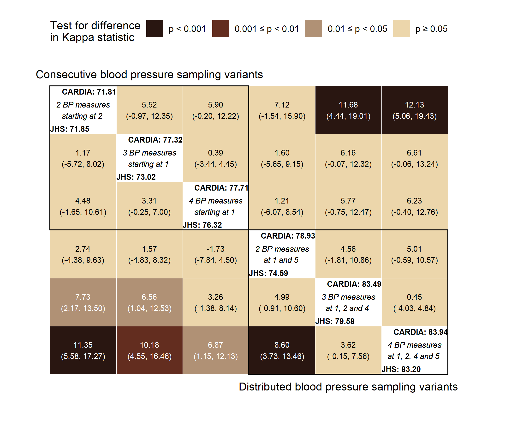

<!-- README.md is generated from README.Rmd. Please edit that file -->

# Number and timing of ABPM

This repository contains all of the R code used to generate results for
the manuscript “Number and Timing of Ambulatory Blood Pressure
Monitoring Measurements”

# Abstract

Ambulatory blood pressure (BP) monitoring (ABPM) may cause sleep
disturbances. Some home BP monitoring (HBPM) devices obtain a limited
number of BP readings during sleep and may be preferred to ABPM.
However, it is unclear how closely a few BP readings approximate a full
night of ABPM. We used data from the Jackson Heart (N=621) and Coronary
Artery Risk Development in Young Adults (N=458) studies to evaluate 74
alternatives for sampling BP during sleep. We sampled 2‒4 BP
measurements at specific times from a full night of ABPM and computed
chance-corrected agreement (i.e., Kappa) between the full night of ABPM
and the subset of BP readings for classification of nocturnal
hypertension (i.e., mean asleep systolic BP≥120 mmHg or diastolic BP≥70
mmHg). Measuring BP at 2, 3, and 4 hours after falling asleep, an
approach applied by some HBPM devices, obtained Kappa of 0.81 (95%
confidence interval \[CI\]: 0.78, 0.85). The highest Kappa was obtained
by measuring BP at 1, 2, 4, and 5 hours after falling asleep: 0.84 (95%
CI: 0.81, 0.87). In conclusion, measuring BP 3 or 4 times during sleep
at specific times may provide nocturnal hypertension diagnoses that have
high agreement with a full night of ABPM.

# Central Illustration

Summary of Kappa statistics (multiplied by 100) for the 6 blood pressure
sampling variations, based on time in hours since falling asleep, with
the highest Kappa statistics in their category. Panels on the diagonal
(white background) show the Kappa statistic values for participants in
the JHS (lower left) and CARDIA study (upper right). Panels on the
off-diagonal show bootstrapped differences between the Kappa statistics
presented on the corresponding diagonal tiles. Differences between the
JHS Kappa statistics are shown below the diagonal while differences
between the CARDIA Kappa statistics are" shown above the diagonal.

<!-- -->

# Acknowledgements

The Jackson Heart Study (JHS) is supported and conducted in
collaboration with Jackson State University (HHSN268201800013I),
Tougaloo College (HHSN268201800014I), the Mississippi State Department
of Health (HHSN268201800015I/HHSN26800001) and the University of
Mississippi Medical Center (HHSN268201800010I, HHSN268201800011I and
HHSN268201800012I) contracts from the National Heart, Lung, and Blood
Institute (NHLBI) and the National Institute for Minority Health and
Health Disparities (NIMHD). The authors also wish to thank the staffs
and participants of the JHS.

The CARDIA (Coronary Artery Risk Development in Young Adults) study is
conducted and supported by the NHLBI in collaboration with the
University of Alabama at Birmingham (HHSN268201800005I and
HHSN268201800007I), Northwestern University (HHSN268 201800003I),
University of Minnesota (HHSN2682018000 06I), and Kaiser Foundation
Research Institute (HHSN268201 800004I). The funding to conduct
ambulatory blood pressure monitoring in the CARDIA study was provided by
grant 15SFRN2390002 from the American Heart Association.

# Disclaimer

The views expressed in this manuscript are those of the authors and do
not necessarily represent the views of the National Heart, Lung, and
Blood Institute; the National Institutes of Health; or the U.S.
Department of Health and Human Services.
